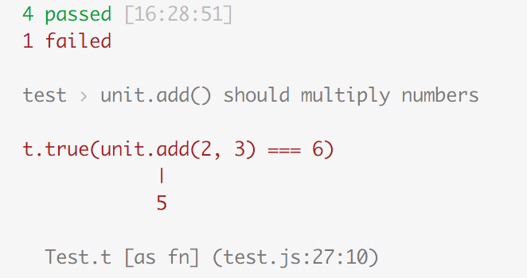
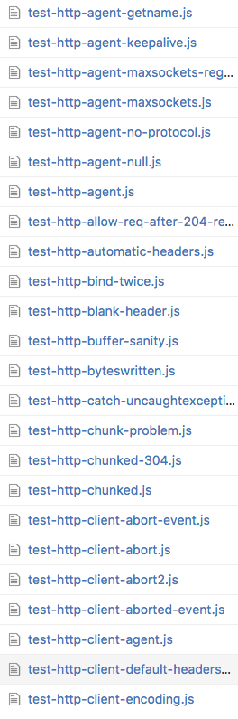

# Andreas Offenhäuser


\#node \#diving \#microservices \#iot \#architecture \#bosch \#skiing

@an0xFF

github.com/anoff


---


# ava/avajs

> 🚀 Futuristic JavaScript test runner


---


# selected features


---


## ⏩ maximum concurrency
* test cases run concurrently
* test files are spawned in parallel (new node process)

Note:
* isolation (yay)
* forces you to write atomic tests


---


## 🔮🔮 integrated ES2015 support
* integrated babel
* write tests and don't worry about transpiling
* transpiles on execution

Note:
* babel behavior can be changed by editing ava settings
* default is stage-2 (whatever that is 💁)


----


```javascript
import test from 'ava';
import unit from './myUnit.js';

test('.add() should add numbers', t => {
  return t.true(unit.add(2+3), 5);
});
```


---


## 💃💃 async/await
> callback < promises < await

* super readable test cases


----


```javascript
// async arrow function
test(async t => {
    let value = await promiseFn();
    value = await nextPromiseFn(value);
    value = await finalFn(value);
    t.true(value);
});
```


---


## 👀🔍 file watch
* watches test and all other `.js` files
* reruns affected tests if
 * test file is modified
 * required source files are modified


----


`ava --watch`


----


```script
// package.json
"scripts": {
  "test": "ava,
  "test:watch: "ava --test"
}

npm test -- --watch
npm run test:watch
```


---


# opinitionated but customizable
* almost everything can be [customized](https://github.com/avajs/ava#configuration)
* `ava` entry in `package.json`


---


# issues


---


## (unlimited) parallelization
🚀🚀🚀🚀🚀🚀🚀🚀🚀🚀🚀🚀🚀🚀🚀🚀🚀🚀🚀🚀🚀🚀🚀🚀🚀🚀🚀🚀🚀🚀🚀🚀🚀🚀🚀
* one process per test file
* 💣💥 for large projects
* use `concurrency=N` to limit (EXPERIMENTAL)


---


## minimalistic API
* AVA strives to be as simple as possible
* no huge assertion libraries (only [powerassert](https://github.com/power-assert-js/power-assert))


----


```javascript
const f = () => 'test';
const throwing = () => { throw new Error('noooo'); };

test('f should not throw', t => {
  t.notThrows(f);
});

test(t => {
  t.truthy(f(), 'f() should return truthy value');
});

test(t => {
  t.throws(throwing);
});
```


----


```javascript
test('unit.add() should multiply numbers', t => {
  return t.true(unit.add(2, 3) === 6);
});
```




---


## 🚫👯 no test grouping
* write small test files
  * multiple testfiles per source
  * refactor code to keep interfaces and tests small
* ["Nested Unit Tests: An Anti-Pattern"?](https://www.briefs.fm/3-minutes-with-kent/27) by Kent C. Dodds


----




Note:
* example out of node core
* each test case has its own file


---


## 😢😢 no browser testing
* can be done using the [browser-env package](https://github.com/avajs/ava/blob/master/docs/recipes/browser-testing.md)
* or try [jest](https://facebook.github.io/jest/)


---


## 🚫📦 v0.17.0
* no stable API
* who knows what sindresorhus is up to next month..


---

* ava is perfect for small projects
* for larger projects invest to analyze your needs
* assertion APIs might help you in larger teams

> give it a try